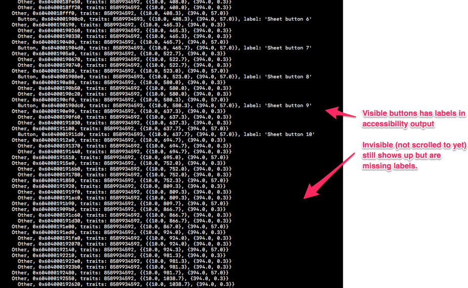

**Summary**

This project demonstrates how the accessibility API lets us access all buttons in an action sheet, but does not show the labels for all.

iOS 11.2 - Shows all buttons in accessibility output, no labels for non-visible buttons  
iOS 10.3 - Shows all buttons in accessibility output, no labels for non-visible buttons  
iOS 9.3 - Shows only the visible buttons  

Example from iOS 11.2 output.

**HowTo**

Just run the UI test in the project. Stop with a breakpoint and run "po app" to see the output.

**Expectations**

I would expect the labels to show for all buttons in the output.
